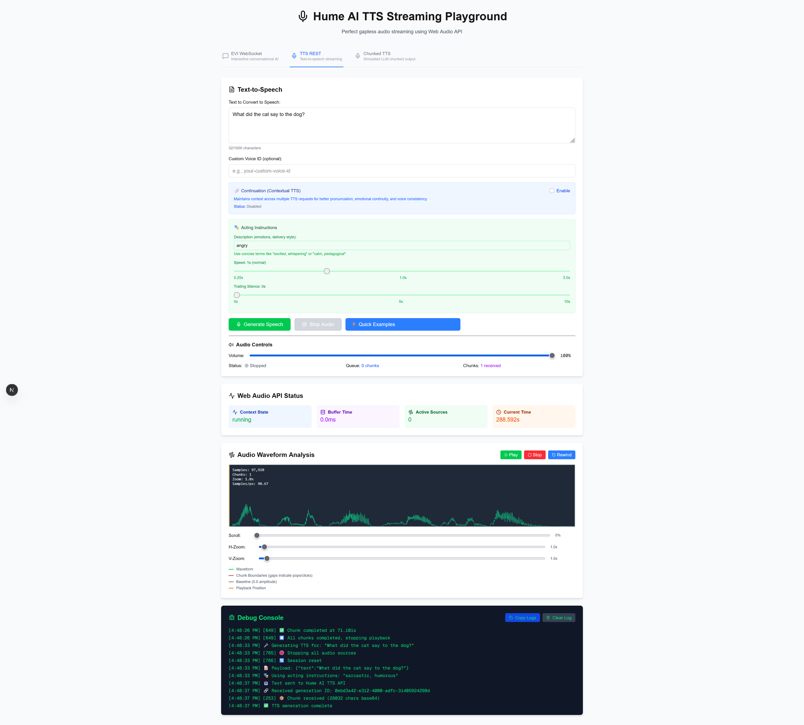

# 🎤 Hume AI TTS Streaming Playground

Welcome! This is a friendly learning tool that demonstrates how to achieve **perfect gapless audio streaming** with Hume AI's Text-to-Speech API. Whether you're just getting started with TTS or trying to solve audio quality issues, this playground will help you understand and implement professional-grade audio streaming.



## 🤔 What is this?

This playground solves a common problem: when streaming text-to-speech audio in real-time, you often hear annoying pops, clicks, or gaps between audio segments. This happens especially when processing longer text in chunks (like an AI assistant responding piece by piece).

**What you'll learn:**
- Why audio streaming can be tricky
- How Web Audio API solves timing problems  
- The difference between sequential, concurrent, and buffered TTS processing
- How continuation maintains context across utterances for better TTS quality
- How acting instructions control emotional expression and delivery style
- How to analyze audio quality with visual tools

## 🌟 What can you do here?

- **Stream Perfect Audio**: Experience completely smooth TTS playback without any artifacts
- **See the Problem**: Watch what happens when audio chunks arrive out of order
- **Understand the Solution**: Learn how buffering and proper scheduling fixes everything
- **Test Continuation**: Enable contextual TTS for better pronunciation and emotional continuity
- **Try Acting Instructions**: Control emotional tone, delivery style, speed, and pauses
- **Analyze Everything**: Use real-time waveform visualization and timing analysis
- **Export Data**: Get detailed timing logs for troubleshooting your own projects

## 🚀 Getting Started

Don't worry - setting this up is straightforward! Just follow these steps:

### 1. Download and Install

```bash
git clone <repository>
cd hume_ai_playground
npm install
```

*Note: You'll need Node.js installed on your computer. If you don't have it, download it from [nodejs.org](https://nodejs.org)*

### 2. Get Your Hume AI Credentials

First, you'll need API keys from Hume AI:

1. Go to [Hume AI Platform](https://platform.hume.ai/settings/keys)
2. Sign up for an account if you don't have one
3. Create new API keys (you'll get an API key and a secret key)

### 3. Configure Your Environment

Create your configuration file:

```bash
cp .env.local.example .env.local
```

Open the `.env.local` file in any text editor and add your keys:
```env
HUME_API_KEY=your_api_key_here
HUME_SECRET_KEY=your_secret_key_here
```

*Tip: Make sure to replace "your_api_key_here" with your actual keys from step 2!*

### 4. Start the Application

```bash
npm run dev
```

Open your web browser and go to: http://localhost:3000

That's it! You should see the playground interface.

## 🎯 Understanding the Problem (and Solution!)

### What Goes Wrong with Audio Streaming?

When you try to play text-to-speech audio in real-time (like a chatbot responding), you might notice:
- **Pops and clicks** between audio segments
- **Stuttering or gaps** that break the flow  
- **Words playing out of order** (very jarring!)

### Why Does This Happen?

Most simple approaches use basic HTML audio elements, which create tiny gaps when switching between audio chunks. It's like trying to play a song by quickly switching between multiple CD players - you'll hear the transitions!

**The real challenge:** When an AI generates text in chunks (like "Hello..." then "how are you..." then "today?"), the audio for these chunks might arrive out of order due to network timing, processing delays, or concurrent requests.

### How This Playground Fixes It

We use the **Web Audio API** - think of it as a professional audio mixing board in your browser:

- **Sample-accurate timing**: Every audio sample is placed exactly where it should be
- **Intelligent buffering**: Chunks are reordered and queued properly  
- **Zero-gap playback**: Audio flows seamlessly from one chunk to the next
- **Visual feedback**: You can actually see the problem and solution!

## 🎮 How to Use the Playground

Once you have it running, you'll see three tabs that each demonstrate different aspects of TTS streaming:

### Tab 1: **Stream TTS** - The Working Solution
This shows the proper way to stream TTS audio:
1. Click **"Connect to Hume AI"** to establish a connection
2. Type any text or select from the **Quick Examples** dropdown
3. Click **"Generate Speech"** and listen to perfect, smooth audio
4. Watch the **debug console** to see timing information
5. Use the **Audio Waveform Analysis** to visualize the audio quality

**Key things to notice:**
- Audio plays smoothly without any pops or clicks
- The waveform shows clean, continuous audio
- Debug logs show precise timing information

### Tab 2: **REST TTS** - Advanced TTS Controls
This demonstrates Hume's REST API with powerful new features:

#### 🔗 **Continuation Feature**
Enable contextual awareness across multiple TTS requests:
1. Check the **"Continuation (Contextual TTS)"** option
2. Generate multiple related utterances to hear how context improves:
   - **Pronunciation**: "bow" sounds different after "performance" vs "archery" context
   - **Emotional flow**: Same phrase sounds excited or disappointed based on previous context
3. Use the **Reset Context** button to start fresh
4. Watch the debug logs show generation IDs being tracked and used

**Try these continuation examples:**
- Generate "What a fantastic performance!" → then "Now take a bow." (sounds like /bau/)
- Generate "First take a quiver of arrows." → then "Now take a bow." (sounds like /bō/)

#### 🎭 **Acting Instructions**
Control exactly how the AI speaks, not just what it says:

**Description Field**: Enter emotions and delivery styles
- Examples: "calm, whispering", "excited, urgent", "sarcastic", "pedagogical"
- Keep it concise (under 100 characters for best results)
- Combine emotions with styles: "excited but whispering"

**Speed Control**: Adjust speaking rate (0.25x to 3.0x)
- 0.65x for meditation or slow explanations
- 1.0x for normal speech
- 1.5x+ for urgent or energetic delivery

**Trailing Silence**: Add strategic pauses (0-10 seconds)
- Perfect for meditation guides, dramatic effect, or breathing room
- Shows in real-time on the slider

**Try these acting instruction examples:**
- "Welcome to our meditation session" + "calm, pedagogical" + 0.65x speed
- "Are you serious right now?" + "sarcastic" 
- "We need to move, now!" + "urgent, panicked"
- "I have something important to tell you" + "whispering, hushed"

3. Compare different emotional deliveries of the same text
4. Notice how speed and silence change the entire feel of the message

### Tab 3: **Chunked TTS** - See the Problem AND Solution!
This is where the magic happens - you can actually experience the problem and see how buffering fixes it:

1. **Sequential Mode**: Click "Start Sequential" to hear how TTS should work
   - Audio plays in the correct order
   - Smooth and natural sounding

2. **Concurrent Mode**: Click "Start Concurrent (Problematic)" to hear the problem
   - Audio chunks may play out of order  
   - You'll hear words in the wrong sequence (very jarring!)
   - This demonstrates what happens without proper buffering

3. **Buffered Mode**: Click "Start Concurrent (Buffered)" to see the solution
   - Audio chunks are reordered automatically
   - Plays smoothly even when chunks arrive out of order
   - This is how you should handle chunked TTS in production

**Analysis Tools:**
- **Timing visualization** shows when chunks are sent vs. when audio arrives
- **Copy CSV** button exports timing data for further analysis
- **Event log** shows detailed information about each chunk

## 🔬 Advanced Features Deep Dive

### 🔗 Continuation: Why Context Matters

**The Problem:** Traditional TTS treats each request independently, leading to:
- Incorrect pronunciation of homographs (words spelled the same but pronounced differently)
- Emotional inconsistency between related utterances
- Voice characteristics that change between requests

**The Solution:** Hume AI's continuation feature maintains context using generation IDs:
- **Linguistic Context**: "bow" after "performance" → /bau/ vs "bow" after "archery" → /bō/
- **Emotional Continuity**: "I can't believe it!" sounds excited after good news, disappointed after bad news
- **Voice Consistency**: Same voice characteristics maintained across multiple requests

**How to Test:**
1. Enable continuation in the REST TTS tab
2. Generate sequential, related utterances
3. Compare with continuation disabled to hear the dramatic difference
4. Watch the debug logs track generation IDs

### 🎭 Acting Instructions: Controlling Expression

**Beyond Words:** Acting instructions let you control **how** the AI speaks:

**Emotional Tone Examples:**
- `happy, joyful` - Upbeat and energetic delivery
- `sad, melancholy` - Slower, more subdued tone  
- `angry, frustrated` - Sharp, emphatic delivery
- `calm, serene` - Peaceful, measured pace
- `excited, enthusiastic` - High energy, animated
- `sarcastic` - Dry, ironic inflection

**Delivery Style Examples:**
- `whispering, hushed` - Very quiet, intimate
- `shouting, loud` - Projected, emphatic  
- `rushed, hurried` - Fast-paced, urgent
- `pedagogical, instructive` - Clear, teaching style
- `conversational, casual` - Natural, relaxed

**Performance Context:**
- `speaking to a large crowd` - Projected, clear articulation
- `intimate conversation` - Soft, personal tone
- `addressing a child` - Gentle, simple delivery
- `professional presentation` - Formal, confident

**Speed Control Technical Details:**
- Non-linear scale: 2.0x isn't exactly twice as fast
- Range: 0.25x (much slower) to 3.0x (much faster)
- Best for: Meditation (0.5-0.7x), Normal (1.0x), Urgent (1.3-2.0x)

**Trailing Silence Use Cases:**
- Meditation: 3-5 seconds between breathing instructions
- Drama: 1-2 seconds for dramatic effect
- Education: 1-2 seconds to let information sink in
- Presentations: 0.5-1 second between points

## 🔍 Understanding the Visual Tools

### Audio Waveform Analysis
The green waveform shows your audio visually:
- **Smooth green line**: Your audio signal
- **Red dashed lines**: Boundaries between audio chunks (gaps here = pops/clicks)
- **Orange line**: Current playback position
- **Zoom controls**: Examine audio quality in detail

### Chunk Timing Analysis (Chunked TTS tab)
The timeline shows:
- **Blue dots**: When text chunks are sent for TTS
- **Green dots**: When audio data is received back
- **Purple lines**: Time from sending to receiving (latency)
- **Numbers above**: Latency in milliseconds

## 🧠 What You'll Learn

By experimenting with this playground, you'll understand:

1. **Why audio streaming is tricky**: Network delays and processing time cause chunks to arrive out of order
2. **How buffering solves it**: By collecting and reordering chunks before playback
3. **The importance of Web Audio API**: For sample-accurate timing and gapless playback
4. **How continuation improves TTS quality**: Context awareness for pronunciation, emotion, and voice consistency
5. **How acting instructions transform delivery**: Emotional control, speed adjustment, and strategic pauses
6. **Professional TTS implementation**: Real-world techniques for production-quality voice applications
7. **How to debug audio issues**: Using visual tools and timing analysis

## 🔧 For Developers: Technical Details

*If you're implementing TTS streaming in your own project, here are the key technical insights:*

### Critical Configuration
```typescript
// This prevents audio pops between chunks
const message = {
  type: 'assistant_input',
  text: text.trim(),
  strip_headers: true  // ← Essential for smooth streaming
};
```

### The Secret: Sample-Accurate Scheduling
```typescript
// Web Audio API allows perfect timing
const startTime = this.nextStartTime;
source.start(startTime);
this.nextStartTime = startTime + audioBuffer.duration; // Zero gaps!
```

### Advanced Features Implementation
```typescript
// Continuation: Track generation IDs for context
const payload = {
  text: "Now take a bow.",
  context: { generation_id: lastGenerationId } // ← Maintains context
};

// Acting Instructions: Control delivery
const payload = {
  utterances: [{
    text: "Welcome to meditation",
    description: "calm, pedagogical", // ← Emotional control
    speed: 0.65,                      // ← Speed adjustment  
    trailing_silence: 3               // ← Strategic pauses
  }]
};
```

### Why This Works
- **Web Audio API** provides sample-level precision
- **Buffering** ensures chunks play in the right order
- **Proper scheduling** eliminates gaps between chunks
- **Continuation** maintains context for natural flow
- **Acting instructions** enable expressive, professional-quality speech
- **Real-time monitoring** helps debug issues

The playground demonstrates all these concepts with working code you can study and adapt.

## ❓ Troubleshooting

**"I get an error when connecting to Hume AI"**
- Double-check your API keys in the `.env.local` file
- Make sure you've copied them exactly from the Hume AI platform
- Ensure your account has TTS API access

**"I don't hear any audio"**
- Check your browser's audio settings
- Try clicking in the browser first (browsers require user interaction before playing audio)
- Look at the debug console for error messages

**"The audio sounds choppy or has artifacts"**
- This is exactly what the playground demonstrates! 
- Try the different modes in the "Chunked TTS" tab to understand why
- The buffered mode should sound perfect

**"I want to adapt this code for my project"**
- Check out the source code in the `lib/` and `components/` directories
- The `WebAudioStreamer.ts` file contains the core streaming logic
- Look at the chunked TTS implementation for buffering examples

## 🤝 Contributing & Feedback

This playground was created to help developers build better TTS applications. We'd love your feedback!

- **Found a bug?** Please report it with details about what you were doing
- **Have a suggestion?** Ideas for new features or improvements are welcome  
- **Want to contribute code?** Pull requests are appreciated
- **Using this in your project?** We'd love to hear about it!

## 💡 What's Next?

After playing with this tool, you might want to:

1. **Study the source code** to understand the implementation details
2. **Adapt the WebAudioStreamer** for your own TTS streaming needs
3. **Experiment with different buffering strategies** based on your use case
4. **Share your experience** with the community to help others

## 🙏 Acknowledgments  

This playground was built with love for the developer community. Special thanks to:

- **Hume AI** for providing an excellent TTS API and great documentation
- **The Web Audio API community** for sharing knowledge about professional audio streaming  
- **Everyone who tests this playground** and provides feedback to make it better

Remember: building great user experiences takes time and experimentation. This playground gives you a head start on solving audio streaming challenges so you can focus on what makes your application unique.

---

**Happy coding!** 🎵✨

*Built with patience and attention to detail to help you create amazing voice experiences.*